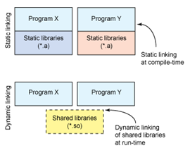

###  knižnica
= spojeniie viacerých skomilovaných súborov do jedného súboru

- knižnice umožňujú zdieľanie kódu medzi aplikáciami

- podľa konvencie mená knižníc začínajú prefixom lib - pri zostavovaní sa zadáva meno knižnice bez prefixu

- typy knižníc (GNU/Linux): statické knižnice (prípona .a) a dynamicky linkované zdieľané knižnice (.so)

### statické knižnice
= súbor s objektovým kódom, ktorý je pripojený (prilinkováný) k spustiteľnému súboru

### dynamické knižnice
1. dynamicky pripojené počas behu, knižnica musí byť počas behu dostupná, ale nie je pripojená k 
spustiteľnému súboru

-zdieľané, kvoli tomu, že môžu byť zdieľané viacerými progamami




Nevýhodou použitia statickej knižnice je, že kód je "zamknutý" v spustiteľnom súbore a nemôže byť zmenený bez opätovnej
 kompilácie. Na rozdiel od toho, dynamická knižnica môže byť modifikovaná bez potreby prekompilovania.


Dynamické knižnice "žijú" mimo spustiteľného súboru, preto program potrebuje pri kompilácii vytvoriť iba jednu kópiu súborov knižnice. 
Naproti tomu používanie statickej knižnice znamená, že každý súbor vo programe musí mať pri kompilácii vlastnú kópiu súborov knižnice.


Nevýhodou používania dynamickej knižnice je, že program je oveľa náchylnejší na pokazenie. 
Ak sa poškodí dynamická knižnica, spustiteľný súbor už nemusí fungovať. Statická knižnica je oproti tomu nedotknuteľná, 
pretože "žije" v spustiteľnom súbore.


Výhodou používania dynamickej knižnice je, že viaceré spustené aplikácie môžu používať rovnakú knižnicu bez toho,
 aby museli mať jej vlastnú kópiu.
 
 Ďalšou výhodou použitia statických knižníc je rýchlosť runtimeu. Viaceré volania funkcií sa dajú spracovať omnoho rýchlejšie ako
 kód dynamickej knižnice, pretože objektový kód je už zahrnutý v spustiteľnom súbore. Objektový kód dynamickej knižnice je treba
 volať zo súborov mimo spustiteľného súboru
 
 V praxi to znamená, že ak vydáme aplikáciu pre tisícky uživateľov a cheme ju aktualizovať
  -  radšej vydáme aktualizáciu vo forme upravených knižníc alebo celý program? To záleží od toho, ktoré ne/výhody sú pre našu 
  aplikáciu prijateľnejšie.

   
   ### Postup vytvorenia statickej knižnice
    
   majme 
   
   subor1.cpp
    
```c++  
#include <iostream> 
void pozdrav(){
  std::cout << "Ahoj" << std::endl;
}
```

 subor2.cpp
 ```c++  
 int odpoved(){ 
    return 42;
 }
 ```
 
 main.cpp
  ```c++  
void pozdrav();
int odpoved();
int main(int, char *[]){ pozdrav();
return 0;
}
  ```
 
 potom
 
 - Preklad do objektového súboru:
 
 ```c++  
    g++ -Wall -O -c subor1.cpp subor2.cpp
   ```
   
 - Vytvorenie statickej knižnice:
  ```c++  
      ar -cvq libtest.a subor1.o subor2.o
  ```
 (c - create, v - verbose, q - quick append)
 
 - Zostavenie programu:
  ```c++  
       g++ -o program main.cpp libtest.a
   ```
   - Spustenie programu:
   ```c++  
          ./program
   ```   
  - Zistenie informácií o statickej knižnici:
   ```c++  
          ar -t libtest.a 
   ```  
  Vypíše súbory z ktorých sa knižnica skladá
  
   ```c++  
          nm libtest.a 
   ```    
   Vypíše symboly z knižnice
  
  
  
   ### Postup vytvorenia dynamickej knižnice
  
   - Preklad do objektových súborov:
   ```c++  
           g++ -Wall -fPIC -c subor1.cpp subor2.cpp  
   ```   
  prepínač fPIC spôsobí generovaanie kódu nezávislého na pozíci v pamäti
  
  - Vytvorenie knižnice:
  ```c++  
 g++ -shared -Wl,-soname,libtest.so.1 -o libtest.so.1.0 *.o
  ```  
  prepínač shared -> vygeneruj zdieľaný objekt
  
  za parametrom Wl naasledujú parametre, ktoré
  prekladač predá zostavovaciemu programu (ld)
  
  presun knižnice do príslušného adresára:
  mv libtest.so.1.0 $HOME/lib
   ```c++  
   mv libtest.so.1.0 $HOME/lib
   ln -sf $HOME/lib/libtest.so.1.0 $HOME/lib/libtest.so.1
   ln -sf $HOME/lib/libtest.so.1 $HOME/lib/libtest.so
   
   ```  
   
   - Zostavenie spustiteľného súboru
   ```c++  
    g++ -L$HOME/lib program.cpp -ltest -o program
   ```  
 parameter L určuje, kde hľadať zdieľané knižnice
 
 - Zistenie zoznamu závislostí:
  ```c++  
    ldd program
   ```  
 - ak spustiteľný program nenašiel knižnicu, tak ju treba pridať do 
  ```c++  
      export LD_LIBRARY_PATH=$HOME/lib:$LD_LIBRARY_PATH
  ```  
a potom
 ```c++  
      ./program
  ```  
 
 
 postup pre windows + visual studio:

https://www.bogotobogo.com/Win32API/Win32API_DLL.php


