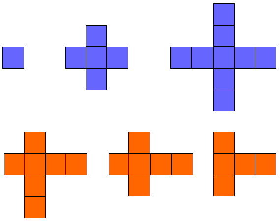
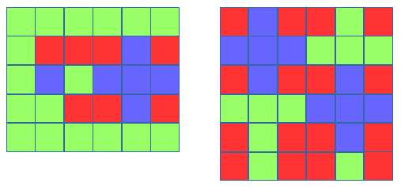

Ema postavila kvantovy pocitac! Pomoz jej ho otestovat riesenim nasledujucej ulohy.

Majme mriezku velkosti n x m, kazda bunka v mriezke je bud dobra alebo zla.

Validny plus definujme ako prekrizenie dvoch segmentov (horizontalneho a vertikalneho) rovnakej dlzky. Dlzka musi byt licha a prostredna bunka horizontalneho segmentu musi krizit prostrednu bunku vertikalneho segmentu.

Diagram znazornuje priklad validnych plusov modrou a nevalidnych plusov oranzovou farbou.



Najdite dve najvacsie validne plusy, ktore mozu byt vykreslene na dobrych bunkach mriezky a vratte integer udavajuci maximalny produkt ich oblasti. Vo vyssie uvedenych diagramoch maju dva najvacsie plusy obsahy 5 a 9 a ich produkt je 5 x 9 = 45.

Poznamka: Dva plusy sa nemozu navzajom prekryvat a produkt ich oblasti by mal byt maximalny. 

## Popis funkcie

Doplnte funkciu twoPluses, ktora ma vracat integer reprezentujuci plochu dvoch najvacsich plusov. Ma jeden parameter, a to mriezku repreyentovanu polom stringov. Kazdy string reprezentuje riadok a kazdy znak stringu reprezentuje stlpec v danom riadku.

## Format vstupu

Prvy riadok obsahuje dva integere oddelene medzerou, n a m.
Dalsich n riadkov obsahuje string m znakov, kde znak je bud G (good) alebo B (bad). Tieto stringy reprezentuju riadky mriezky. Ak je y-ty znak na x-tom riadku G, tak (x,y) je dobra bunka. Inak je bunka zla.

## Obmedzenia

2 <= n <= 15

2 <= m <= 15

## Format vystupu

Najdite 2 plusy, ktore je mozne vykreslit na zadanej mriezke cez dobre bunky a vratte integer udavajuci maximalny produkt ich oblasti.

## Vzorovy vstup 0
```c++  
5 6
GGGGGG
GBBBGB
GGGGGG
GGBBGB
GGGGGG
```
## Vzorovy vystup 0

5

## Vzorovy vstup 1
```c++  
6 6
BGBBGB
GGGGGG
BGBBGB
GGGGGG
BGBBGB
BGBBGB
```
## Vzorovy Vystup 1

25

Vysvetlenie

Mozne riesenia pre vzor 0 nalavo a vzor 1 napravo:



vysvetlenie:
zelena = dobra bunka
cervena = zla bunka
modra = mozny plus

plus dlzky i oznacme ako Pi

vzor 0:
V mriezke je dostatok miesta na jeden P3 plus a jeden P1 plus. Obsah(P3) = 5j, Obsah(P1) = 1j a 5 x 1 = 5.

vzor 1:
V mriezke je dostatok miesta na dva P3 plusy. Obsah(P3)= 5j a 5 x 5 = 25 

    
```c++  


 #include <bits/stdc++.h>
 
 using namespace std;
 
 vector<string> split_string(string);
 
 // Doplnte funkciu twoPluses 
 int twoPluses(vector<string> grid) {
 
 
 }
 
 int main()
 {
     ofstream fout("output.txt",std::ofstream::out);
 
     string nm_temp;
     getline(cin, nm_temp);
 
     vector<string> nm = split_string(nm_temp);
 
     int n = stoi(nm[0]);
 
     int m = stoi(nm[1]);
 
     vector<string> grid(n);
 
     for (int i = 0; i < n; i++) {
         string grid_item;
         getline(cin, grid_item);
 
         grid[i] = grid_item;
     }
 
     int result = twoPluses(grid);
 
     fout << result << "\n";
 
     fout.close();
 
     return 0;
 }
 
 vector<string> split_string(string input_string) {
     string::iterator new_end = unique(input_string.begin(), input_string.end(), [] (const char &x, const char &y) {
         return x == y and x == ' ';
     });
 
     input_string.erase(new_end, input_string.end());
 
     while (input_string[input_string.length() - 1] == ' ') {
         input_string.pop_back();
     }
 
     vector<string> splits;
     char delimiter = ' ';
 
     size_t i = 0;
     size_t pos = input_string.find(delimiter);
 
     while (pos != string::npos) {
         splits.push_back(input_string.substr(i, pos - i));
 
         i = pos + 1;
         pos = input_string.find(delimiter, i);
     }
 
     splits.push_back(input_string.substr(i, min(pos, input_string.length()) - i + 1));
 
     return splits;
 }

```
